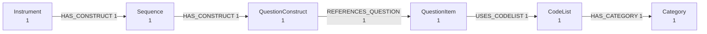

# Lesson 2 — Look before you load

!!! abstract "What you will learn"
    - Inspect an unfamiliar DDI file without installing a database
    - Read the shape of a graph from counts alone
    - Spot the difference between the three flavors in their output

## The problem

Someone sends you a 65 MB XML file. What is in it?

Opening it in an editor tells you very little — you see the first screen of
a hundred thousand lines. Loading it into a database tells you a lot, but
you have to set up the database first, and if the file turns out to be the
wrong one you did that for nothing.

`ddigraph preview` sits in that gap. It parses the file and tells you what
it found. No database, no optional extras.

## Your first preview

<!-- runnable -->
```bash
ddigraph preview "$CODEBOOK_FIXTURE"
```

```text
Nodes: 62   Relationships: 73

Node types
  DDIGenericIdentifiable  14
  Universe                5
  Concept                 4
  QuestionItem            3
  Variable                3
  Category                2
  ...

Relationships
  (DDIGenericIdentifiable)-[:IN_DATASET]->(Dataset)  14
  (Universe)-[:IN_DATASET]->(Dataset)  5
  ...
```

Read that as a summary of the *shape*, not the contents. Sixty-two nodes
across thirty-two types, joined by seventy-three edges.

Notice what it does not do: it does not draw sixty-two boxes. A real survey
has tens of thousands of nodes, and a box per node is a picture of nothing.
Grouping by type is what makes the answer fit on a screen.

## What the counts tell you

Two things are worth noticing in that output.

**`DDIGenericIdentifiable` is the largest type.** That is the catch-all for
DDI elements without a bespoke record class. Seeing it at the top means the
file uses a lot of elements this parser handles generically. That is not an
error — it round-trips fine — but it tells you where the detail is thin.

**Almost everything points at `Dataset`.** That is Codebook's signature: one
central study node that the rest hangs off. Compare it with Lifecycle:

<!-- runnable -->
```bash
ddigraph preview "$FIXTURE"
```

```text
Nodes: 6   Relationships: 5

Node types
  Category           1
  CodeList           1
  Instrument         1
  QuestionConstruct  1
  QuestionItem       1
  Sequence           1

Relationships
  (CodeList)-[:HAS_CATEGORY]->(Category)  1
  (Instrument)-[:HAS_CONSTRUCT]->(Sequence)  1
  (QuestionConstruct)-[:REFERENCES_QUESTION]->(QuestionItem)  1
  (QuestionItem)-[:USES_CODELIST]->(CodeList)  1
  (Sequence)-[:HAS_CONSTRUCT]->(QuestionConstruct)  1
```

No `Dataset`, no `IN_DATASET`. Instead a chain:
`Instrument → Sequence → QuestionConstruct → QuestionItem → CodeList → Category`.
That is the questionnaire flow, written as edges. This is the "obviously a
graph" flavor from lesson 1, and you can see it in five lines of output.

## Counts are not proof

Counts tell you the shape. They do not tell you the right things were
parsed. For that, ask for examples:

<!-- runnable -->
```bash
ddigraph preview "$CODEBOOK_FIXTURE" --limit 2
```

Each type now gets up to two real identities printed under it:

```text
Sample Variable
  variable_id=v1
  variable_id=v2
```

If those look wrong — empty, duplicated, obviously truncated — you have
found a problem before spending anything on a load.

## Two other shapes of the same answer

The default is text because you are in a terminal. Two other renderings
exist for two other readers.

<!-- runnable -->
```bash
# A diagram, for pasting into docs or a pull request
ddigraph preview "$FIXTURE" --format mermaid

# One HTML file: no CDN, no JavaScript, works offline and survives email
ddigraph preview "$FIXTURE" --format html -o preview.html
```

The Mermaid output renders as a real diagram wherever Mermaid is
supported, which includes this documentation and GitHub comments:



## Exercise

Preview the DDI-CDI fixture and compare it with the other two.

<!-- runnable -->
```bash
ddigraph preview "$CDI_FIXTURE"
```

Every type name shares something the other two flavors' names did not.
What is it, and why would a tool bother?

??? success "Solution"
    Every type is prefixed `CDI`: `CDIConcept`, `CDICodeList`,
    `CDICategory`, `CDIInstanceVariable`. The prefix
    exists because type names collide across flavors — `Category`,
    `CodeList` and `Universe` all appear in Codebook, Lifecycle *and* CDI,
    with different identity fields. Prefixing keeps them apart in one
    database.

    That collision is not a curiosity. It is why `ddigraph shapes` takes a
    `--flavor` argument: twenty-one type names appear in more than one
    flavor, and a constraint that is right for one is wrong for another.
    You will meet this again in lesson 5.

## Check yourself

- Why does preview aggregate to type counts instead of drawing every node?
- What in the output distinguishes a Codebook file from a Lifecycle one?
- What does `--limit` give you that the counts cannot?

---

Next: [Nodes, edges, identity](03-the-graph-model.md) — getting at the same
data from Python instead of the terminal.
