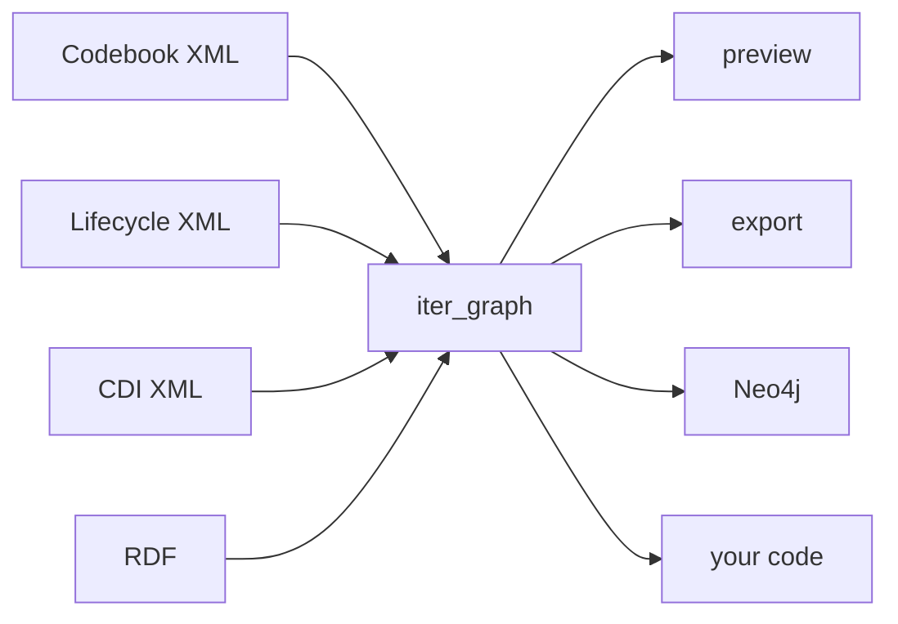

# Lesson 3 — Nodes, edges, identity

!!! abstract "What you will learn"
    - Stream any DDI file as plain nodes and relationships from Python
    - Read the three fields every node has, and what each is for
    - Understand why one seam serves all three flavors

## One shape for three formats

Lesson 2 previewed three very different files with one command. That works
because of a single function underneath: `iter_graph`.

It takes a path, works out the flavor, and yields the same thing for all
three — chunks of nodes and relationships. Everything else in the package
sits on top of it. The previewer, the RDF exporter, the Neo4j writer, the
SHACL validator: all of them consume `iter_graph` and none of them knows
which flavor it started from.



That last arrow is the point of this lesson.

## Streaming a file

<!-- runnable -->
```python
import os

from ddigraph import iter_graph

for chunk in iter_graph(os.environ["FIXTURE"]):
    for node in chunk.nodes:
        print(node.label, node.identity)
```

```text
Instrument {'fragment_id': 'urn:ddi:test.org:inst1:1.0'}
Sequence {'fragment_id': 'urn:ddi:test.org:seq1:1.0'}
QuestionConstruct {'fragment_id': 'urn:ddi:test.org:qc1:1.0'}
QuestionItem {'fragment_id': 'urn:ddi:test.org:q1:1.0'}
CodeList {'fragment_id': 'urn:ddi:test.org:cl1:1.0'}
Category {'fragment_id': 'urn:ddi:test.org:cat1:1.0'}
```

Note the word *stream*. `iter_graph` is a generator that yields chunks as
it parses, so memory stays flat whether the file is 6 KB or 65 MB. It never
holds the whole graph.

## The three fields of a node

Every node has exactly three things.

**`label`** — what kind of thing it is. `QuestionItem`, `CodeList`. This
becomes the Neo4j label and the RDF class.

**`identity`** — the fields that say *which* one it is. Usually a single
key, but not always, and that matters: some node types are identified by a
combination of fields, and using only the first would merge distinct things
into one.

**`properties`** — everything else. Labels, text, agency, version.

<!-- runnable -->
```python
import os

from ddigraph import iter_graph

for chunk in iter_graph(os.environ["FIXTURE"]):
    for node in chunk.nodes:
        if node.label == "QuestionItem":
            print("identity  ", node.identity)
            print("properties", sorted(node.properties))
```

```text
identity   {'fragment_id': 'urn:ddi:test.org:q1:1.0'}
properties ['agency', 'ddi_id', 'fragment_id', 'label', ...]
```

Identity is a **dict**, not a string, precisely because it can hold more
than one key. Treat it as a whole and you will not be caught out.

!!! warning "Use the whole identity"
    Building a key from the *first* identity value is the tempting
    shortcut, and it fails quietly. Take a node type keyed on three fields:
    every node that happens to share the first field collapses onto one
    key, and their properties merge. You get fewer nodes than you started
    with and no error to tell you so.

    `DDIGenericIdentifiable` in the Codebook fixture is keyed on
    `(dataset_id, element_tag, identifiable_id)`. All fourteen of them
    share a `dataset_id`.

## Relationships

A relationship has a type and two endpoints, and each endpoint is a node:

<!-- runnable -->
```python
import os

from ddigraph import iter_graph

for chunk in iter_graph(os.environ["FIXTURE"]):
    for edge in chunk.relationships:
        print(f"({edge.start.label})-[:{edge.type}]->({edge.end.label})")
```

```text
(Instrument)-[:HAS_CONSTRUCT]->(Sequence)
(Sequence)-[:HAS_CONSTRUCT]->(QuestionConstruct)
(QuestionConstruct)-[:REFERENCES_QUESTION]->(QuestionItem)
(QuestionItem)-[:USES_CODELIST]->(CodeList)
(CodeList)-[:HAS_CATEGORY]->(Category)
```

That is the chain from lesson 2, now as objects you can act on. The
endpoints carry identity too, which is what lets a consumer match an edge
to nodes it saw in an earlier chunk.

## Why chunks and not a list

`iter_graph` yields `GraphChunk` objects rather than one flat list, and the
reason is ordering.

For DDI-L the parser runs in two phases: every node first, then every
relationship. It has to. An edge can point at a fragment that appears later
in the file, so the parser cannot build the edge until it has seen
everything. Chunking makes that visible instead of hiding it behind a list
that would have to be fully materialised anyway.

For your code the practical consequence is simple: **do not assume a
chunk's edges refer to nodes in that same chunk.** Collect nodes first, then
wire edges. Lesson 6 does exactly that.

## Exercise

Count the nodes and relationships in the Codebook fixture, grouped by type,
without using `ddigraph preview`.

??? success "Solution"
    ```python
    import collections
    import os

    from ddigraph import iter_graph

    nodes = collections.Counter()
    edges = collections.Counter()

    for chunk in iter_graph(os.environ["CODEBOOK_FIXTURE"]):
        nodes.update(node.label for node in chunk.nodes)
        edges.update(edge.type for edge in chunk.relationships)

    print(sum(nodes.values()), "nodes,", sum(edges.values()), "relationships")
    for label, count in nodes.most_common(5):
        print(f"  {label:24} {count}")
    ```

    This is, more or less, what `ddigraph preview` does. The previewer is
    about a hundred lines on top of `iter_graph`, and nothing in it is
    privileged — you have the same access it does.

## Check yourself

- Why is `identity` a dict rather than a string?
- Why can an edge in one chunk refer to a node from an earlier chunk?
- What would you have to change to make your code work on DDI-CDI instead
  of DDI-L?

---

Next: [Joining the wider world](04-linked-data.md) — turning these nodes
into RDF that other systems already understand.
