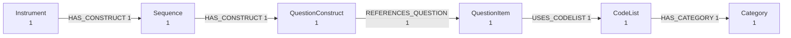

# Command Line Interface

The package installs a `ddigraph` command with subcommands for schema bootstrap, format detection,
and ingestion. The CLI **auto-detects DDI format** by default, supporting DDI Codebook,
DDI-L FragmentInstance, and DDI-CDI files.

## Commands Overview

| Command | Description |
| --------- | ------------- |
| `bootstrap` | Create constraints and indexes (Codebook + DDI-L by default; pass `--no-include-fragments` for codebook-only) |
| `load` | Stream a DDI or RDF file into Neo4j (auto-detects format) |
| `export` | Write a DDI file as RDF, JSON, or CSV. No database needed |
| `shapes` | Write SHACL shapes for the DDI vocabulary |
| `preview` | Summarise what is in a DDI file. No database needed |
| `validate` | Check a DDI file against its official XSD |
| `detect` | Detect the DDI format of a file without loading it |
| `version` | Print the installed ddigraph version |

## Schema Bootstrap

`bootstrap` creates the indexes and constraints Neo4j needs before
your first load. It is safe to run more than once.

```bash
# Codebook + DDI-L FragmentInstance (default)
ddigraph bootstrap --neo4j-uri bolt://db:7687 --neo4j-user neo4j --neo4j-password password

# Codebook only
ddigraph bootstrap --no-include-fragments

# Also create the DDI-CDI schema. Off by default: no shipped writer
# creates DDI-CDI nodes, so the constraints would go unused.
ddigraph bootstrap --include-cdi
```

## Exporting Files

`export` writes a file instead of loading a database, so it needs no Neo4j
connection at all. It works on Codebook, Lifecycle and CDI input.

```bash
# RDF
ddigraph export survey.xml --format turtle -o survey.ttl
ddigraph export survey.xml --format jsonld -o survey.jsonld

# Publish under your own namespace
ddigraph export survey.xml --format turtle -o out.ttl \
  --base-uri https://example.org/id/

# Plain data. These two need no optional extra.
ddigraph export survey.xml --format json -o survey.json
ddigraph export survey.xml --format csv -o out-dir/
```

Formats are `turtle`, `ntriples`, `jsonld`, `rdfxml`, `json` and `csv`. The
RDF formats need the `rdf` extra. CSV writes `nodes.csv` and
`relationships.csv` into a directory, because a graph does not fit one
table.

| Option | Description |
| -------- | ------------- |
| `-o`, `--output` | Output file, or output directory for `--format csv` |
| `--format` | Output format (default: `turtle`) |
| `--base-uri` | IRI stem for records with no DDI URN |
| `--dataset-id` | Dataset identifier for Codebook input (default: the file stem) |
| `--dataset-name` | Human-readable dataset name for Codebook input |
| `--json` | Print the result summary as JSON |

## SHACL Shapes

`shapes` writes SHACL shapes for the vocabulary. They are derived from the
same schema that builds the Neo4j constraints, so they cannot drift from
the data.

```bash
ddigraph shapes -o shapes.ttl
ddigraph shapes -o shapes.ttl --flavor lifecycle
```

Pass `--flavor` when validating real data. A file has exactly one flavor,
and 21 DDI type names appear in more than one flavor with different keys.
Without it, shapes for the other flavors are also emitted, and the
constraints the flavors disagree on are left out.

## Previewing a File

`preview` answers "what is actually in this file?" before you commit to a
load. It parses the file and prints what it found. It never opens a
database, and it needs no optional extra.

<!-- runnable -->
```bash
ddigraph preview "$FIXTURE"
```

The first line echoes the path you gave it:

```text
Preview: survey.xml
Nodes: 6   Relationships: 5

Node types
  Category           1
  CodeList           1
  Instrument         1
  QuestionConstruct  1
  QuestionItem       1
  Sequence           1

Relationships
  (CodeList)-[:HAS_CATEGORY]->(Category)  1
  (Instrument)-[:HAS_CONSTRUCT]->(Sequence)  1
  (QuestionConstruct)-[:REFERENCES_QUESTION]->(QuestionItem)  1
  (QuestionItem)-[:USES_CODELIST]->(CodeList)  1
  (Sequence)-[:HAS_CONSTRUCT]->(QuestionConstruct)  1
```

This is the *shape* of the graph, not every node. A real survey runs to
tens of thousands of nodes, and a box per node is unreadable. Grouping
them into types and `type -[EDGE]-> type` counts gets it down to
something you can take in at a glance.

Two other formats write the same summary for a different reader:

<!-- runnable -->
```bash
# Paste into the docs, a GitHub comment, or any Mermaid viewer
ddigraph preview "$FIXTURE" --format mermaid

# One self-contained HTML page: no CDN, no JavaScript, works offline
ddigraph preview "$FIXTURE" --format html -o preview.html
```

The Mermaid output is a `graph LR` definition:



Counts tell you the shape but not whether the right thing was parsed.
`--limit` adds example identities per type, so you can check:

<!-- runnable -->
```bash
ddigraph preview "$CODEBOOK_FIXTURE" --limit 2
```

```text
Sample Variable
  variable_id=v1
  variable_id=v2
```

| Option | Description |
| -------- | ------------- |
| `--format` | `text`, `mermaid` or `html` (default: `text`) |
| `-o`, `--output` | Write to a file instead of stdout |
| `--limit` | Show up to N example nodes per type (default: 0, counts only) |
| `--dataset-id` | Dataset identifier for Codebook input (default: the file stem) |

## Validating Against the XSD

`validate` checks a file against the official DDI schema, which ships with
the package. It picks the schema from the flavor and, for DDI-L, from the
version the document declares in its own namespace.

<!-- runnable -->
```bash
ddigraph validate "$FIXTURE" --max-issues 3 || true
```

```text
File:   fragment_instance.xml
Flavor: lifecycle 3.3
Schema: instance_3_3.xsd
Result: invalid (3 issue(s))
  line 8: Element '{ddi:datacollection:3_3}Instrument', attribute 'id': The attribute 'id' is not allowed.
```

It exits non-zero on a violation, so a CI step is one line:

```bash
ddigraph validate survey.xml || exit 1
```

`load` and `export` take `--validate` to run the same check first and
refuse a file that does not conform:

```bash
ddigraph load survey.xml --validate
ddigraph export survey.xml --validate -o out.ttl
```

| Option | Description |
| -------- | ------------- |
| `--flavor` | Force `codebook`, `lifecycle` or `cdi` instead of detecting |
| `--max-issues` | Report at most N issues (default: 20, `0` reports all) |
| `--json` | Print the result as JSON |

**Validation is off by default, deliberately.** Published DDI is often
imperfect: it parses, it loads, it does not strictly validate. Every XML
fixture in this repository is in that position. Refusing files that work
would make the tool less useful, so strictness is something you opt into.

## Loading Data

The `load` command auto-detects the DDI format and uses the appropriate loader:

```bash
# Auto-detect format (default behavior)
ddigraph load /path/to/survey.xml --dataset-id demo

# Explicitly specify format
ddigraph load /path/to/codebook.xml --format codebook --dataset-id demo
ddigraph load /path/to/questionnaire.xml --format lifecycle

# For DDI-L FragmentInstance, --dataset-id is optional
ddigraph load /path/to/fragments.xml

# Load an RDF graph. Recognised by file extension, or force it
# with --format rdf.
ddigraph load /path/to/survey.ttl
```

### Load Options

```bash
ddigraph load FILE [OPTIONS]
Options:
  --format {auto,codebook,lifecycle,cdi}  DDI format (default: auto)
  --dataset-id ID                     Dataset identifier (required for Codebook)
  --dataset-name NAME                 Human-readable dataset name
  --chunk-size N                      Records per batch (default: 200)
  --writer-concurrency N              Concurrent writer tasks
  --dry-run / --validate-only         Parse without writing to Neo4j
  --replace                           Clear existing data before loading
  --json                              Output results as JSON
  --tune KEY=VALUE                    Set any Settings field (repeatable)
  --config FILE                       TOML file of Settings fields
```

Every dedicated flag above has a long form. You do not need to learn a
flag for each setting. `--tune KEY=VALUE` sets any `Settings` field by
name, and you can repeat it. `--config FILE` reads a flat TOML table of
the same fields. A dedicated flag wins over `--tune`, which wins over
`--config`, which wins over environment variables.

### Examples

```bash
# Stream a DDI Codebook with ingestion tuning
ddigraph load /path/to/codebook.xml --dataset-id demo --dataset-name "Demo Survey" \
  --chunk-size 500 --writer-concurrency 2 --batch-metrics --log-level DEBUG
# Validate a load without writing (parsing and Cypher plans only)
ddigraph load /path/to/codebook.xml --dataset-id demo --dry-run

# Purge an existing dataset before reloading
ddigraph load /path/to/codebook.xml --dataset-id demo --replace

# Load DDI-L FragmentInstance with JSON output
ddigraph load /path/to/questionnaire.xml --json

# Set any setting without a dedicated flag
ddigraph load /path/to/codebook.xml --dataset-id demo \
  --tune chunk_size=500 --tune strict_parsing=true

# Or keep the same settings in a TOML file
ddigraph load /path/to/codebook.xml --dataset-id demo --config tuning.toml
```

## Format Detection

Detect the DDI format of a file without loading it:

```bash
ddigraph detect /path/to/survey.xml

# Output:
# Format: lifecycle
# File: /path/to/survey.xml

ddigraph detect /path/to/survey.xml --json
# Output: {"path": "/path/to/survey.xml", "format": "lifecycle"}

ddigraph detect /path/to/cdi-metadata.xml
# Output:
# Format: cdi
# File: /path/to/cdi-metadata.xml
```

The `detect_ddi_format()` function returns one of three values: `"codebook"`, `"lifecycle"`, or
`"cdi"`. The `is_cdi_format()` utility function is also available for CDI-specific detection.

## Environment Variables

Export Neo4j connection details from your shell or a `.env` file:

```bash
export DDIGRAPH_NEO4J_URI=bolt://localhost:7687
export DDIGRAPH_NEO4J_USER=neo4j
export DDIGRAPH_NEO4J_PASSWORD=secret
export DDIGRAPH_NEO4J_DATABASE=neo4j  # optional, defaults to "neo4j"
```

### Complete Flag and Environment Variable Mapping

Every CLI flag maps 1:1 to a `DDIGRAPH_` environment variable. Booleans accept truthy/falsy
strings (`true/false`, `1/0`).

#### Connection Options

| CLI Flag | Environment Variable | Description |
| ---------- | --------------------- | ------------- |
| `--neo4j-uri` | `DDIGRAPH_NEO4J_URI` | Neo4j bolt/s URI |
| `--neo4j-user` | `DDIGRAPH_NEO4J_USER` | Neo4j username |
| `--neo4j-password` | `DDIGRAPH_NEO4J_PASSWORD` | Neo4j password |
| `--neo4j-database` | `DDIGRAPH_NEO4J_DATABASE` | Target database (default: `neo4j`) |

#### Driver Pooling

| CLI Flag | Environment Variable | Description |
| ---------- | --------------------- | ------------- |
| `--max-connection-pool-size` | `DDIGRAPH_MAX_CONNECTION_POOL_SIZE` | Max pooled connections |
| `--connection-timeout` | `DDIGRAPH_CONNECTION_TIMEOUT` | Connection open timeout (seconds) |
| `--max-connection-lifetime` | `DDIGRAPH_MAX_CONNECTION_LIFETIME` | Pool lifetime (seconds) |
| `--session-timeout` | `DDIGRAPH_SESSION_TIMEOUT` | Session lifetime (seconds) |
| `--transaction-timeout` | `DDIGRAPH_TRANSACTION_TIMEOUT` | Server-side transaction timeout |

#### TLS Options

| CLI Flag | Environment Variable | Description |
| ---------- | --------------------- | ------------- |
| `--encrypted` | `DDIGRAPH_ENCRYPTED` | Require TLS connections |
| `--verify-hostname` | `DDIGRAPH_VERIFY_HOSTNAME` | Verify TLS hostname |
| `--trusted-certificates` | `DDIGRAPH_TRUSTED_CERTIFICATES` | Trust policy (e.g., `TRUST_ALL_CERTIFICATES`) |
| `--trusted-certificates-file` | `DDIGRAPH_TRUSTED_CERTIFICATES_FILE` | PEM bundle path |

#### Ingestion Tuning

| CLI Flag | Environment Variable | Description |
| ---------- | --------------------- | ------------- |
| `--queue-maxsize` | `DDIGRAPH_QUEUE_MAXSIZE` | Back-pressure threshold (batches) |
| `--chunk-size` | `DDIGRAPH_CHUNK_SIZE` | Records per batch |
| `--writer-concurrency` | `DDIGRAPH_WRITER_CONCURRENCY` | Concurrent writer tasks |
| `--batch-metrics` | `DDIGRAPH_BATCH_METRICS` | Emit per-batch metrics |
| `--strict-parsing` | `DDIGRAPH_STRICT_PARSING` | Fail on XML syntax errors |
| `--dry-run` / `--validate-only` | `DDIGRAPH_DRY_RUN` | Parse without writing |
| `--replace` | `DDIGRAPH_REPLACE` | Purge dataset before loading |

#### Retry Settings

| CLI Flag | Environment Variable | Description |
| ---------- | --------------------- | ------------- |
| `--write-retry-attempts` | `DDIGRAPH_WRITE_RETRY_ATTEMPTS` | Total retry attempts |
| `--write-retry-base-delay` | `DDIGRAPH_WRITE_RETRY_BASE_DELAY` | Base backoff delay (seconds) |
| `--write-retry-jitter` | `DDIGRAPH_WRITE_RETRY_JITTER` | Max jitter (seconds) |

#### Logging

| CLI Flag | Environment Variable | Description |
| ---------- | --------------------- | ------------- |
| `--log-level` | `DDIGRAPH_LOG_LEVEL` | Logging verbosity (`DEBUG`, `INFO`, etc.) |
| `--metrics-namespace` | `DDIGRAPH_METRICS_NAMESPACE` | Metrics prefix |

## TLS Configuration Examples

```bash
# AuraDB (encryption on; rely on platform/system CAs)
DDIGRAPH_NEO4J_URI=neo4j+s://<your-aura-host>:7687 \
  ddigraph bootstrap --encrypted

# Self-signed certificate from a private Neo4j deployment
DDIGRAPH_ENCRYPTED=true \
DDIGRAPH_TRUSTED_CERTIFICATES_FILE=/etc/ssl/certs/private-ca.pem \
  ddigraph load /path/to/codebook.xml --dataset-id demo
```

## Retry Configuration

Tune retry behavior for different network conditions:

```bash
# Tighten retries for fast failure when the cluster is healthy
ddigraph load /path/to/codebook.xml --dataset-id demo \
  --write-retry-attempts 2 --write-retry-base-delay 0.1 --write-retry-jitter 0

# Loosen retries to survive intermittent packet loss
DDIGRAPH_WRITE_RETRY_ATTEMPTS=5 \
DDIGRAPH_WRITE_RETRY_BASE_DELAY=1.0 \
DDIGRAPH_WRITE_RETRY_JITTER=0.5 \
  ddigraph load /path/to/codebook.xml --dataset-id demo
```

## Combined Examples

Copy/pasteable snippets for common operational setups:

```bash
# Hard cap transaction duration and retry with jitter
ddigraph load /path/to/codebook.xml --dataset-id demo \
  --transaction-timeout 15 --write-retry-attempts 5 \
  --write-retry-base-delay 0.5 --write-retry-jitter 0.25

# Batch-level observability with strict parsing
DDIGRAPH_BATCH_METRICS=true \
  ddigraph load /path/to/codebook.xml --dataset-id demo \
  --strict-parsing --chunk-size 500 --queue-maxsize 4

# Load DDI-L FragmentInstance with full schema bootstrap
ddigraph bootstrap
ddigraph load /path/to/questionnaire.xml --chunk-size 300

# Validate DDI-L file without writing
ddigraph load /path/to/questionnaire.xml --dry-run --json
```

## Behavior Notes

- **Format auto-detection**: When `--format auto` (the default), the CLI inspects the XML root
  element to determine Codebook, FragmentInstance, or CDI format.
- **Dataset ID validation**: For Codebook format, `--dataset-id` is required. For FragmentInstance,
  it's optional (fragments are self-identifying).
- **Dry-run and replace**: When `--dry-run` is enabled, `--replace` is ignored (no data is
  modified).
- **Strict vs. forgiving parsing**: Default forgiving mode enables XML recovery to stream past
  malformed markup. Enable `--strict-parsing` to fail fast on syntax errors.

See [Architecture](../user-guide/architecture.md) and [DDI-L FragmentInstance](../user-guide/fragments.md) for design context.
