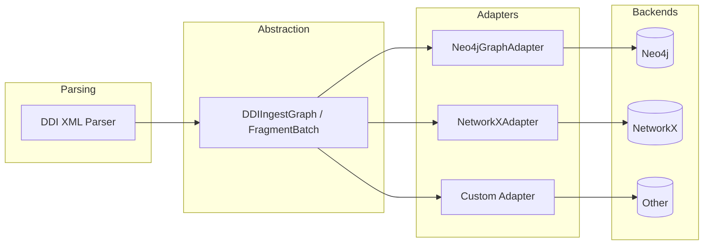

# Custom Adapters

!!! note "Who is this page for?"
    This page is for developers who want to send ddigraph data to a database or
    tool that is not built in. **If you use Neo4j, RDF/SPARQL, Gremlin, or
    NetworkX, you can skip this page.** Those adapters already exist and work out
    of the box.

## How Adapters Work

ddigraph splits its work into two steps. First it **reads** DDI data from XML.
Then it **writes** that data to a database. An **adapter** is the bridge between
the two steps. It takes the parsed data and writes it to the storage you choose.

So you can swap out the storage part (Neo4j, NetworkX, your own database) without
changing how the DDI data is read. The parser always produces the same output. The
adapter decides where it goes.




## The GraphWriteAdapter Interface

To write a custom adapter, your class must implement the `GraphWriteAdapter`
interface. An interface here means a standard set of two methods your class must
have.

In Python, this kind of interface is called a `Protocol`. Think of it as a job
description: a graph adapter must have `write_batch()` and `purge_dataset()`
methods. Your class does not need to inherit from anything. It just needs those
two methods with the right signatures.

```python
from ddigraph.schema.adapter import GraphWriteAdapter

class GraphWriteAdapter(Protocol):
    def write_batch(
        self,
        graph: DDIIngestGraph,
        *,
        session_config: dict[str, object] | None = None,
        transaction_config: dict[str, object] | None = None,
    ) -> None | Awaitable[None]:
        """Write a batch of DDI data to the graph."""
        ...
    def purge_dataset(
        self,
        dataset_id: str,
        *,
        session_config: dict[str, object] | None = None,
        transaction_config: dict[str, object] | None = None,
    ) -> None | Awaitable[None]:
        """Remove all nodes and relationships for a dataset."""
        ...
```

## Default: Neo4j Adapter

ddigraph uses the built-in `Neo4jGraphAdapter` automatically. This happens when
you create a `DDILoader` without naming an adapter. You never set it up by hand:

```python
from ddigraph.ingest.loader import DDILoader
from ddigraph.config import Settings

# Neo4j adapter is created automatically
loader = DDILoader(driver, settings=Settings())
await loader.load("ddi.xml", dataset_id="ds123")
```

## Writing Your Own Adapter

Do you want a database that is not built in? Write a class with `write_batch()`
and `purge_dataset()` methods. Then pass it to the loader:

```python
from ddigraph.ingest.loader import DDILoader
from ddigraph.schema.adapter import GraphWriteAdapter

class MyGraphAdapter(GraphWriteAdapter):
    async def write_batch(self, graph, **kwargs):
        # Translate graph.nodes() / graph.relationships()
        # into backend-specific write operations
        for node in graph.nodes():
            self.backend.create_node(node["label"], node["properties"])
        for rel in graph.relationships():
            self.backend.create_relationship(
                rel["start"], rel["end"], rel["type"], rel["properties"]
            )
    async def purge_dataset(self, dataset_id, **kwargs):
        self.backend.delete_by_dataset(dataset_id)

adapter = MyGraphAdapter()
loader = DDILoader(driver, adapter=adapter)
```

Your adapter receives a `DDIIngestGraph` object. Call `graph.nodes()` to get a
list of nodes. Call `graph.relationships()` to get a list of relationships. Each
item is a plain dictionary with `label`, `id`, and `properties` keys. You do not
need any DDI-specific knowledge.

## Example: NetworkX Adapter

The adapter contract integrates with popular graph packages. This example pushes ingested records
into a NetworkX `MultiDiGraph` for local analysis without a database:

```python
import networkx as nx

from ddigraph.ingest.loader import DDILoader
from ddigraph.schema.adapter import GraphWriteAdapter

class NetworkXAdapter(GraphWriteAdapter):
    def __init__(self):
        self.graph = nx.MultiDiGraph()
    async def write_batch(self, graph, **kwargs):
        # Add nodes with labels and properties
        for node in graph.nodes():
            label = node["label"]
            props = node["properties"]
            self.graph.add_node(node["id"], label=label, **props)
        # Add relationships with type and properties
        for rel in graph.relationships():
            self.graph.add_edge(
                rel["start"],
                rel["end"],
                key=rel["type"],
                **rel["properties"],
            )
    async def purge_dataset(self, dataset_id, **kwargs):
        # Remove nodes matching the dataset
        nodes_to_remove = [
            n for n, d in self.graph.nodes(data=True)
            if d.get("dataset_id") == dataset_id
        ]
        self.graph.remove_nodes_from(nodes_to_remove)

# Usage
adapter = NetworkXAdapter()
loader = DDILoader(driver=None, adapter=adapter)
await loader.load("ddi.xml", dataset_id="ds123")

# Analyze with NetworkX
print(f"Nodes: {adapter.graph.number_of_nodes()}")
print(f"Edges: {adapter.graph.number_of_edges()}")

# Find paths between entities
paths = nx.all_simple_paths(adapter.graph, source="var1", target="concept1", cutoff=3)
```

## FragmentInstance Loader

The DDI-L FragmentInstance loader (`DDIFragmentLoader`) uses a similar pattern with
`AsyncFragmentGraphWriter`, which batches fragments by type for efficient UNWIND queries:

```python
from ddigraph.ingest.fragment_loader import DDIFragmentLoader
loader = DDIFragmentLoader(driver, settings=settings)
result = await loader.load("questionnaire.xml")
```

The FragmentInstance writer handles:

- Batched node creation by element type
- Relationship creation grouped by relationship type
- Retry logic with exponential backoff
- Entry point marking

### Extending FragmentInstance Writing

To customize FragmentInstance persistence, subclass `AsyncFragmentGraphWriter`:

```python
from ddigraph.ingest.fragment_loader import AsyncFragmentGraphWriter, FragmentBatch

class CustomFragmentWriter(AsyncFragmentGraphWriter):
    async def write_batch(self, batch: FragmentBatch) -> dict[str, int]:
        # Custom batch processing
        for element_type, fragments in batch.fragments_by_type.items():
            for fragment in fragments:
                self.custom_backend.store(fragment.to_dict())
        for from_id, rel_type, to_id in batch.relationships:
            self.custom_backend.link(from_id, rel_type, to_id)
        return {"processed": batch.total_fragments()}
```

## Other Adapter Targets

The adapter pattern supports various backends:

| Target | Use Case |
| -------- | ---------- |  
| **Gremlin** | JanusGraph, Amazon Neptune, Azure Cosmos DB |
| **RDF/SPARQL** | Semantic web triplestores |
| **Pandas** | DataFrame-based analysis |
| **JSON/CSV** | File-based export |
| **GraphQL** | API-based graph services |

### Gremlin Example Sketch

```python
from gremlin_python.process.traversal import T

class GremlinAdapter(GraphWriteAdapter):
    def __init__(self, g):
        self.g = g  # GraphTraversalSource
    async def write_batch(self, graph, **kwargs):
        for node in graph.nodes():
            self.g.addV(node["label"]).property(T.id, node["id"])
            for key, value in node["properties"].items():
                self.g.property(key, value)
        for rel in graph.relationships():
            self.g.V(rel["start"]).addE(rel["type"]).to(__.V(rel["end"]))
```

## Best Practices

1. **Batch operations**: Accumulate writes and flush in batches for performance
2. **Idempotent writes**: Use MERGE/upsert semantics to handle retries safely
3. **Error handling**: Implement retry logic for transient failures
4. **Async support**: Return `Awaitable` for async backends
5. **Metrics**: Emit timing and count metrics for observability

## Schema Integration

Adapters can use `DDISchema` for consistent schema information:

```python
from ddigraph.schema import DDISchema

# Get node definitions
for node in DDISchema.get_all_nodes(include_fragments=True):
    print(f"{node.label}: id_field={node.id_field}, indexes={node.indexes}")

# Generate constraint queries for your backend
queries = DDISchema.generate_constraint_queries(include_fragments=True)
```

## Working Examples

The `demo/` directory includes complete adapter implementations that you can run and modify:

- **`load_rdf.py`** - RDF/SPARQL adapter using rdflib
  - Maps DDI fragments to RDF triples
  - Exports to Turtle, N-Triples, RDF/XML, JSON-LD
  - Demonstrates SPARQL queries
  - Compatible with Virtuoso, GraphDB, Stardog triplestores

- **`load_gremlin.py`** - Gremlin adapter using TinkerGraph
  - Traversal-based graph queries
  - Pattern matching and path analysis
  - Compatible with JanusGraph, Amazon Neptune, Azure Cosmos DB

- **`load_networkx.py`** - NetworkX adapter for local analysis
  - In-memory graph analysis
  - Path queries and connectivity analysis
  - GraphML export

- **`load_pandas.py`** - pandas adapter for tabular analysis
  - DataFrames per node type
  - Relationship analysis
  - Excel export

Each demo shows the complete adapter implementation pattern with parsing, loading, analysis, and export. See the [demo directory on GitHub](https://github.com/pbisson44/ddigraph/tree/main/demo) for usage instructions.

See [Architecture](architecture.md) for end-to-end design and [DDI-L FragmentInstance](fragments.md)
for fragment-specific details.
