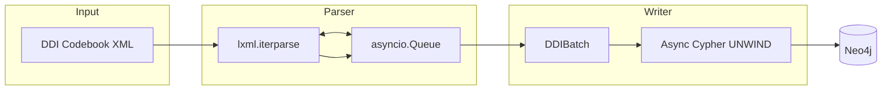
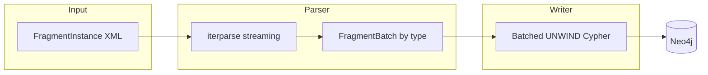
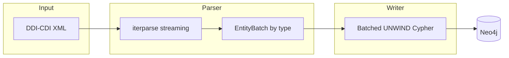

# How It Loads Your Data

!!! note "Optional deep-dive"
    You don't need to read this page to use ddigraph. It explains the internal design —
    useful when you want to tune performance or understand why something behaves a certain way.
    If you're just getting started, go to [Your First Queries](../getting-started/first-queries.md).

---

ddigraph converts DDI XML files into a graph database. It is built around three goals:

- **Scalability** — works on files of any size without running out of memory
- **Observability** — you can see what is happening during a load
- **Fault isolation** — if one record fails, the rest still succeed

---

## Supported DDI Formats

ddigraph supports three DDI format families, each with its own loader:

### DDI Codebook (`DDILoader`)

The older, simpler format. All metadata connects to a central `Dataset` node.



*The file is read piece-by-piece (Parser), buffered in a queue, then written to Neo4j in
batches (Writer).*

### DDI-L FragmentInstance (`DDIFragmentLoader`)

The newer DDI Lifecycle 3.x format. Each `<Fragment>` is a reusable piece of metadata that
can reference other fragments, naturally forming a graph structure.



### DDI-CDI 1.0 (`parse_cdi_batches`)

DDI Cross-Domain Integration — the newest DDI standard. It describes a wider range of data
types: concepts, variables, classifications, data structures, and processes.



### Format Auto-Detection

ddigraph can detect which format your file uses automatically. It reads the root XML element:

- `FragmentInstance` → uses the lifecycle loader
- `codeBook`, `codebook`, `DDIInstance` → uses the codebook loader
- DDI-CDI namespace or root elements → uses the CDI loader

You can also call `detect_ddi_format("your_file.xml")` in Python, or let the CLI choose
automatically with `ddigraph load`.

---

## What Gets Loaded

### DDI Codebook

The Codebook loader extracts these categories of metadata into graph nodes:

- **Datasets & studies** — the overall study and its data collection events
- **Files & structures** — data files, logical records, and physical data structures
- **Variables & questions** — survey questions, question grids, question flows, and
  variables (including links to universes, categories, and source questions)
- **Codes & concepts** — code lists, categories, concepts, universes, and representations
- **Groups & organizations** — organizations, series, groups, and category groups
- **Methodology & processing** — sampling procedures, weights, methodology notes, and
  processing events
- **Extended coverage** — citations, geographic/temporal coverage, funding, collection
  instruments, and access policies

### DDI-L FragmentInstance

The FragmentInstance loader preserves the graph structure of DDI-L 3.x files:

| Node Type | What it represents |
| ----------- | ----------------- |
| `Instrument` | The survey instrument (entry point) |
| `Sequence` | An ordered list of questions |
| `IfThenElse` | A conditional branch (show question only if...) |
| `Loop` | A repeated section |
| `QuestionConstruct` | A question reference within the flow |
| `QuestionItem` | A single question |
| `QuestionGrid` | A grid/matrix of questions |
| `CodeList` | A list of answer choices |
| `Category` | One answer choice |
| `StatementItem` | Display text (not a question) |
| `ComputationItem` | A derived or calculated variable |
| `Universe` | The population this question applies to |
| `Concept` | A conceptual definition |
| `Variable` | A data variable |
| `StudyUnit` | Overall study metadata |
| `DataCollection` | Data collection metadata |

See [DDI-L FragmentInstance](fragments.md) for detailed coverage.

### DDI-CDI 1.0

The CDI loader covers all 210 concrete top-level entity elements declared in `ddi-cdi.xsd`.
The ~35 most commonly referenced types use hand-tuned record classes; the remaining entities
round-trip through `CDIGenericRecord`. A representative sample of the bespoke types by domain:

| Node Type | Domain |
| ----------- | -------- |
| `Concept`, `ConceptualDomain`, `ConceptSystem`, `UnitType`, `Universe`, `Population` | Concepts |
| `InstanceVariable`, `RepresentedVariable`, `ConceptualVariable` | Variables |
| `Category`, `Code`, `ClassificationIndex`, `ClassificationItem`, `CodeList`, `StatisticalClassification` | Classifications |
| `WideDataSet`, `WideDataStructure`, `DataStore`, `LogicalRecord` | Data structures |
| `Agent`, `Activity`, `CorrespondenceTable` | Agents & process |

---

## Configuration

ddigraph reads its settings from environment variables (or a `.env` file). The main settings are:

- **Neo4j connection** — URI, username, password, database name
- **Batching** — `chunk_size` (records per batch), `queue_maxsize`, `writer_concurrency`
- **Retry** — `write_retry_attempts`, `write_retry_base_delay`, `write_retry_jitter`
- **Parsing** — `strict_parsing` (fail on invalid XML), `dry_run`, `replace`

See [Configuration](../reference/configuration.md) for all available settings.

---

## How the Schema Works

All node types, relationships, and database constraints are defined in one place:
`ddigraph.schema.definitions`. This single source of truth is used by the loaders,
the schema bootstrap, and the adapters.

```python
from ddigraph.schema import DDISchema

# Generate all index/constraint queries
queries = DDISchema.generate_all_schema_queries(include_fragments=True, include_cdi=True)

# Look up the relationship type for a DDI-L reference field
rel_type = DDISchema.get_fragment_relationship_type("ControlConstructReference")
# Returns: "HAS_CONSTRUCT"
```

### Schema Bootstrap

Run `ddigraph bootstrap` once before your first load. It creates:

- **Unique constraints** on identity fields (`id` for Codebook nodes, `fragment_id` for
  FragmentInstance nodes) — prevents duplicate nodes
- **Secondary indexes** on `name`, `label`, and `description` — makes lookups fast

It is safe to run more than once. If the index or constraint already exists, nothing changes.

```bash
ddigraph bootstrap                          # Codebook + DDI-L (default)
ddigraph bootstrap --no-include-fragments   # Codebook only
```

---

## How Large Files Stay Fast

### Streaming Parsing

ddigraph uses `iterparse` — a streaming XML parser that reads one element at a time.
After each element is processed, it is deleted from memory. This keeps memory usage
constant no matter how large the file is.

```python
# Each element is processed then immediately cleared from memory
for _, elem in etree.iterparse(xml_file, events=("end",)):
    process(elem)
    elem.clear()
    while elem.getprevious() is not None:
        del elem.getparent()[0]
```

Without streaming, a 5 GB file would require 5 GB of RAM. With streaming, the same file
uses only a small, fixed amount of memory.

### Back-Pressure (Codebook Loader)

A queue sits between the parser and the database writer. If the database is writing slowly,
the queue fills up. Once full, it pauses the parser until the writer catches up. This prevents
memory from growing without limit when writing is slower than reading.

Think of it like a buffer at a car wash: if the wash bay is full, no more cars are admitted
until one exits.

### Batched Writes

Instead of writing one record to Neo4j at a time, ddigraph groups records into batches and
sends them all in a single query using Cypher's `UNWIND` clause:

```cypher
UNWIND $batch AS props
MERGE (n:Sequence {fragment_id: props.fragment_id})
SET n += props
```

This reduces database round trips by 10–100x. Instead of 1,000 queries (one per record),
there might be 10 queries (100 records each).

### Async I/O

- **Codebook loader** — reads and writes at the same time using multiple concurrent writer tasks
- **FragmentInstance loader** — writes asynchronously while parsing proceeds in batches

---

## Fault Tolerance

| Feature | What it means |
|---|---|
| Schema bootstrap is safe to repeat | Uses `IF NOT EXISTS` — running it twice won't break anything |
| Batch-level isolation | Each batch is its own transaction — a failure in one batch doesn't affect others |
| `MERGE` semantics | Retrying a failed batch won't create duplicate nodes |
| Retry with backoff | Temporary Neo4j errors are retried automatically with increasing wait times |
| Input validation | Bad configuration values are caught at startup, not mid-load |

---

## Adding a Custom Backend

The loader sends data through a `GraphWriteAdapter` interface (a standard set of methods).
You can plug in any database by writing a class that implements this interface.
See [Custom Adapters](adapter.md) for examples.

### Adding Custom Node Types

To add your own node types or relationships:

1. Extend `DDISchema` in `src/ddigraph/schema/definitions/`
2. Update the appropriate loader to extract the new XML elements
3. Regenerate bootstrap queries from the schema

---

## CI/CD

GitHub Actions runs Ruff (code style), mypy (type checking), and pytest (tests) on every
push and pull request. This prevents regressions and keeps code quality consistent.
