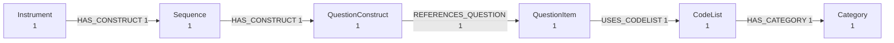

# Leçon 2 — Regarder avant de charger

!!! abstract "Ce que vous allez apprendre"
    - Inspecter un fichier DDI inconnu sans installer de base de données
    - Lire la forme d'un graphe à partir des seuls décomptes
    - Repérer la différence entre les trois variantes dans la sortie

## Le problème

Quelqu'un vous envoie un fichier XML de 65 Mo. Qu'y a-t-il dedans ?

L'ouvrir dans un éditeur ne dit presque rien : vous voyez le premier écran
de cent mille lignes. Le charger dans une base en dit beaucoup, mais il
faut d'abord installer la base — et si ce n'était pas le bon fichier, vous
l'avez fait pour rien.

`ddigraph preview` occupe cet espace. La commande analyse le fichier et
vous dit ce qu'elle a trouvé. Pas de base, pas d'extra optionnel.

## Votre premier aperçu

<!-- runnable -->
```bash
ddigraph preview "$CODEBOOK_FIXTURE"
```

```text
Nodes: 62   Relationships: 73

Node types
  DDIGenericIdentifiable  14
  Universe                5
  Concept                 4
  QuestionItem            3
  Variable                3
  Category                2
  ...

Relationships
  (DDIGenericIdentifiable)-[:IN_DATASET]->(Dataset)  14
  (Universe)-[:IN_DATASET]->(Dataset)  5
  ...
```

Lisez cela comme un résumé de la *forme*, pas du contenu. Soixante-deux
nœuds répartis sur trente-deux types, reliés par soixante-treize arcs.

Remarquez ce que la commande ne fait pas : elle ne dessine pas
soixante-deux boîtes. Une enquête réelle compte des dizaines de milliers de
nœuds, et une boîte par nœud est une image de rien. Le regroupement par
type est ce qui fait tenir la réponse sur un écran.

## Ce que les décomptes vous disent

Deux choses méritent attention dans cette sortie.

**`DDIGenericIdentifiable` est le type le plus nombreux.** C'est le
fourre-tout des éléments DDI sans classe d'enregistrement dédiée. Le voir
en tête signifie que le fichier utilise beaucoup d'éléments traités de
façon générique. Ce n'est pas une erreur — l'aller-retour fonctionne — mais
cela vous dit où le détail est mince.

**Presque tout pointe vers `Dataset`.** C'est la signature de Codebook :
un nœud d'étude central auquel le reste se rattache. Comparez avec
Lifecycle :

<!-- runnable -->
```bash
ddigraph preview "$FIXTURE"
```

```text
Nodes: 6   Relationships: 5

Node types
  Category           1
  CodeList           1
  Instrument         1
  QuestionConstruct  1
  QuestionItem       1
  Sequence           1

Relationships
  (CodeList)-[:HAS_CATEGORY]->(Category)  1
  (Instrument)-[:HAS_CONSTRUCT]->(Sequence)  1
  (QuestionConstruct)-[:REFERENCES_QUESTION]->(QuestionItem)  1
  (QuestionItem)-[:USES_CODELIST]->(CodeList)  1
  (Sequence)-[:HAS_CONSTRUCT]->(QuestionConstruct)  1
```

Pas de `Dataset`, pas de `IN_DATASET`. À la place, une chaîne :
`Instrument → Sequence → QuestionConstruct → QuestionItem → CodeList → Category`.
C'est le déroulé du questionnaire, écrit comme des arcs. Voilà la variante
« manifestement un graphe » de la leçon 1, visible en cinq lignes.

## Les décomptes ne sont pas une preuve

Les décomptes donnent la forme. Ils ne disent pas que les bonnes choses ont
été analysées. Pour cela, demandez des exemples :

<!-- runnable -->
```bash
ddigraph preview "$CODEBOOK_FIXTURE" --limit 2
```

Chaque type reçoit alors jusqu'à deux identités réelles :

```text
Sample Variable
  variable_id=v1
  variable_id=v2
```

Si elles paraissent fausses — vides, dupliquées, visiblement tronquées —
vous avez trouvé un problème avant d'avoir rien dépensé.

## Deux autres formes de la même réponse

Le texte est le format par défaut parce que vous êtes dans un terminal.
Deux autres rendus existent pour deux autres lecteurs.

<!-- runnable -->
```bash
# Un diagramme, à coller dans la documentation ou une pull request
ddigraph preview "$FIXTURE" --format mermaid

# Un seul fichier HTML : sans CDN ni JavaScript, il marche hors ligne
ddigraph preview "$FIXTURE" --format html -o preview.html
```

La sortie Mermaid s'affiche comme un vrai diagramme partout où Mermaid est
pris en charge, y compris cette documentation et les commentaires GitHub :



## Exercice

Affichez l'aperçu du fichier DDI-CDI et comparez-le aux deux autres.

<!-- runnable -->
```bash
ddigraph preview "$CDI_FIXTURE"
```

Tous les noms de types partagent quelque chose que les noms des deux autres
variantes n'avaient pas. Quoi, et pourquoi un outil s'en soucierait-il ?

??? success "Solution"
    Chaque type est préfixé `CDI` : `CDIConcept`, `CDICodeList`,
    `CDICategory`, `CDIInstanceVariable`. Le préfixe existe parce que les
    noms de types entrent en collision entre variantes — `Category`,
    `CodeList` et `Universe` apparaissent dans Codebook, Lifecycle *et*
    CDI, avec des champs d'identité différents. Le préfixe les sépare dans
    une même base.

    Cette collision n'est pas une curiosité. C'est la raison pour laquelle
    `ddigraph shapes` prend un argument `--flavor` : vingt et un noms de
    types apparaissent dans plusieurs variantes, et une contrainte juste
    pour l'une est fausse pour une autre. Vous retrouverez ce point en
    leçon 5.

## Vérifiez-vous

- Pourquoi l'aperçu agrège-t-il par type au lieu de dessiner chaque nœud ?
- Qu'est-ce qui distingue un fichier Codebook d'un fichier Lifecycle ?
- Que vous donne `--limit` que les décomptes ne peuvent pas donner ?

---

Suivant : [Nœuds, arcs, identité](03-the-graph-model.md) — accéder aux
mêmes données depuis Python plutôt que depuis le terminal.
