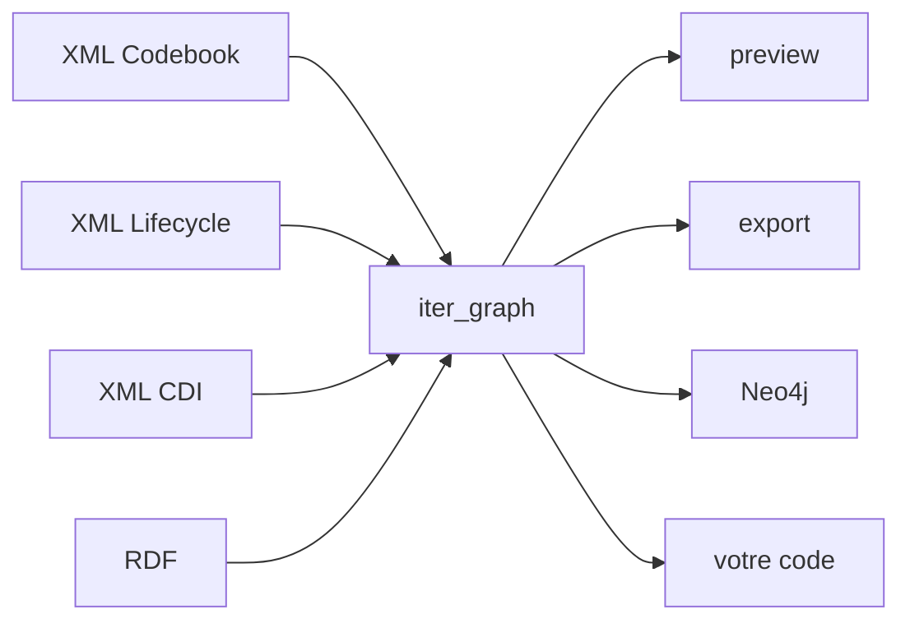

# Leçon 3 — Nœuds, arcs, identité

!!! abstract "Ce que vous allez apprendre"
    - Diffuser tout fichier DDI en nœuds et relations depuis Python
    - Lire les trois champs de chaque nœud et savoir à quoi ils servent
    - Comprendre pourquoi une seule couture sert les trois variantes

## Une forme pour trois formats

La leçon 2 a prévisualisé trois fichiers très différents avec une seule
commande. Cela fonctionne grâce à une fonction unique en dessous :
`iter_graph`.

Elle prend un chemin, détermine la variante, et produit la même chose pour
les trois — des morceaux de nœuds et de relations. Tout le reste du package
repose dessus. L'aperçu, l'exportateur RDF, l'écrivain Neo4j, le validateur
SHACL : tous consomment `iter_graph` et aucun ne sait de quelle variante on
est parti.



Cette dernière flèche est l'objet de cette leçon.

## Diffuser un fichier

<!-- runnable -->
```python
import os

from ddigraph import iter_graph

for chunk in iter_graph(os.environ["FIXTURE"]):
    for node in chunk.nodes:
        print(node.label, node.identity)
```

```text
Instrument {'fragment_id': 'urn:ddi:test.org:inst1:1.0'}
Sequence {'fragment_id': 'urn:ddi:test.org:seq1:1.0'}
QuestionConstruct {'fragment_id': 'urn:ddi:test.org:qc1:1.0'}
QuestionItem {'fragment_id': 'urn:ddi:test.org:q1:1.0'}
CodeList {'fragment_id': 'urn:ddi:test.org:cl1:1.0'}
Category {'fragment_id': 'urn:ddi:test.org:cat1:1.0'}
```

Notez le mot *diffuser*. `iter_graph` est un générateur qui produit des
morceaux au fil de l'analyse : la mémoire reste plate que le fichier fasse
6 Ko ou 65 Mo. Il ne détient jamais le graphe entier.

## Les trois champs d'un nœud

Chaque nœud possède exactement trois choses.

**`label`** — de quel type de chose il s'agit. `QuestionItem`, `CodeList`.
Cela devient le label Neo4j et la classe RDF.

**`identity`** — les champs qui disent *lequel* c'est. Souvent une seule
clé, mais pas toujours, et c'est important : certains types sont identifiés
par une combinaison de champs, et n'utiliser que le premier fusionnerait
des choses distinctes.

**`properties`** — tout le reste. Libellés, textes, agence, version.

<!-- runnable -->
```python
import os

from ddigraph import iter_graph

for chunk in iter_graph(os.environ["FIXTURE"]):
    for node in chunk.nodes:
        if node.label == "QuestionItem":
            print("identité  ", node.identity)
            print("propriétés", sorted(node.properties))
```

```text
identité   {'fragment_id': 'urn:ddi:test.org:q1:1.0'}
propriétés ['agency', 'ddi_id', 'fragment_id', 'label', ...]
```

`identity` est un **dictionnaire**, pas une chaîne, précisément parce qu'il
peut contenir plusieurs clés. Traitez-le comme un tout et vous ne serez pas
pris au dépourvu.

!!! warning "Utilisez l'identité entière"
    Construire une clé à partir de la *première* valeur d'identité est le
    raccourci tentant, et il échoue en silence. Prenez un type de nœud
    identifié par trois champs : tous ceux qui partagent le premier champ
    se retrouvent sur une même clé, et leurs propriétés fusionnent. Vous
    obtenez moins de nœuds qu'au départ, sans la moindre erreur pour vous
    le signaler.

    `DDIGenericIdentifiable`, dans le fichier Codebook, est identifié par
    `(dataset_id, element_tag, identifiable_id)`. Les quatorze partagent un
    même `dataset_id`.

## Les relations

Une relation a un type et deux extrémités, et chaque extrémité est un nœud :

<!-- runnable -->
```python
import os

from ddigraph import iter_graph

for chunk in iter_graph(os.environ["FIXTURE"]):
    for edge in chunk.relationships:
        print(f"({edge.start.label})-[:{edge.type}]->({edge.end.label})")
```

```text
(Instrument)-[:HAS_CONSTRUCT]->(Sequence)
(Sequence)-[:HAS_CONSTRUCT]->(QuestionConstruct)
(QuestionConstruct)-[:REFERENCES_QUESTION]->(QuestionItem)
(QuestionItem)-[:USES_CODELIST]->(CodeList)
(CodeList)-[:HAS_CATEGORY]->(Category)
```

C'est la chaîne de la leçon 2, désormais sous forme d'objets manipulables.
Les extrémités portent aussi leur identité, ce qui permet à un consommateur
de rattacher un arc à des nœuds vus dans un morceau antérieur.

## Pourquoi des morceaux et pas une liste

`iter_graph` produit des objets `GraphChunk` plutôt qu'une seule liste
plate, et la raison est l'ordonnancement.

Pour DDI-L, l'analyseur travaille en deux phases : tous les nœuds d'abord,
puis toutes les relations. Il le doit. Un arc peut désigner un fragment qui
apparaît plus loin dans le fichier ; l'analyseur ne peut donc pas le
construire avant d'avoir tout vu. Le découpage rend cela visible au lieu de
le cacher derrière une liste qu'il faudrait de toute façon matérialiser en
entier.

Pour votre code, la conséquence pratique est simple : **ne supposez pas que
les arcs d'un morceau désignent des nœuds du même morceau.** Collectez
d'abord les nœuds, puis câblez les arcs. La leçon 6 fait exactement cela.

## Exercice

Comptez les nœuds et les relations du fichier Codebook, groupés par type,
sans utiliser `ddigraph preview`.

??? success "Solution"
    ```python
    import collections
    import os

    from ddigraph import iter_graph

    nodes = collections.Counter()
    edges = collections.Counter()

    for chunk in iter_graph(os.environ["CODEBOOK_FIXTURE"]):
        nodes.update(node.label for node in chunk.nodes)
        edges.update(edge.type for edge in chunk.relationships)

    print(sum(nodes.values()), "nœuds,", sum(edges.values()), "relations")
    for label, count in nodes.most_common(5):
        print(f"  {label:24} {count}")
    ```

    C'est, à peu de chose près, ce que fait `ddigraph preview`. L'aperçu
    représente une centaine de lignes au-dessus de `iter_graph`, et rien
    n'y est privilégié : vous disposez du même accès que lui.

## Vérifiez-vous

- Pourquoi `identity` est-il un dictionnaire plutôt qu'une chaîne ?
- Pourquoi un arc d'un morceau peut-il désigner un nœud d'un morceau antérieur ?
- Que faudrait-il changer pour que votre code fonctionne sur DDI-CDI au
  lieu de DDI-L ?

---

Suivant : [Rejoindre le monde extérieur](04-linked-data.md) — transformer
ces nœuds en RDF que d'autres systèmes comprennent déjà.
