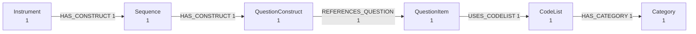

# Référence CLI

Le package installe une commande `ddigraph` avec des sous-commandes pour l'amorçage du schéma,
la détection de format et l'ingestion. Le CLI **détecte automatiquement le format DDI** par
défaut, prenant en charge les fichiers DDI Codebook, DDI-L FragmentInstance et DDI-CDI.

## Vue d'ensemble des commandes

| Commande | Description |
| --------- | ------------- |
| `bootstrap` | Créer les contraintes et index (Codebook + DDI-L par défaut ; ajoutez `--no-include-fragments` pour le codebook seul) |
| `load` | Charger en flux un fichier DDI ou RDF dans Neo4j (détection automatique du format) |
| `export` | Écrire un fichier DDI en RDF, JSON ou CSV. Aucune base requise |
| `shapes` | Écrire les formes SHACL du vocabulaire DDI |
| `preview` | Résumer le contenu d'un fichier DDI. Aucune base requise |
| `validate` | Vérifier un fichier DDI contre son XSD officiel |
| `detect` | Détecter le format DDI d'un fichier sans le charger |
| `version` | Afficher la version de ddigraph installée |

## Amorçage du schéma

`bootstrap` crée les index et contraintes dont Neo4j a besoin avant
votre premier chargement. Vous pouvez l'exécuter plusieurs fois sans
risque.

```bash
# Codebook + DDI-L FragmentInstance (par défaut)
ddigraph bootstrap --neo4j-uri bolt://db:7687 --neo4j-user neo4j --neo4j-password password

# Codebook seul
ddigraph bootstrap --no-include-fragments

# Créer aussi le schéma DDI-CDI. Désactivé par défaut : aucun writer
# fourni n'écrit de nœuds DDI-CDI, les contraintes resteraient inutiles.
ddigraph bootstrap --include-cdi
```

## Exporter des fichiers

`export` écrit un fichier au lieu de charger une base : aucune connexion
Neo4j n'est nécessaire. La commande accepte les entrées Codebook,
Lifecycle et CDI.

```bash
# RDF
ddigraph export survey.xml --format turtle -o survey.ttl
ddigraph export survey.xml --format jsonld -o survey.jsonld

# Publier sous votre propre espace de noms
ddigraph export survey.xml --format turtle -o out.ttl \
  --base-uri https://example.org/id/

# Données simples. Ces deux formats ne demandent aucun extra.
ddigraph export survey.xml --format json -o survey.json
ddigraph export survey.xml --format csv -o out-dir/
```

Les formats sont `turtle`, `ntriples`, `jsonld`, `rdfxml`, `json` et `csv`.
Les formats RDF demandent l'extra `rdf`. Le format CSV écrit `nodes.csv` et
`relationships.csv` dans un dossier, car un graphe ne tient pas dans un
seul tableau.

| Option | Description |
| -------- | ------------- |
| `-o`, `--output` | Fichier de sortie, ou dossier pour `--format csv` |
| `--format` | Format de sortie (par défaut : `turtle`) |
| `--base-uri` | Racine d'IRI pour les enregistrements sans URN DDI |
| `--dataset-id` | Identifiant du jeu de données pour une entrée Codebook |
| `--dataset-name` | Nom lisible du jeu de données pour une entrée Codebook |
| `--json` | Afficher le résumé du résultat en JSON |

## Formes SHACL

`shapes` écrit les formes SHACL du vocabulaire. Elles dérivent du schéma
qui construit aussi les contraintes Neo4j : elles ne peuvent donc pas
diverger des données.

```bash
ddigraph shapes -o shapes.ttl
ddigraph shapes -o shapes.ttl --flavor lifecycle
```

Utilisez `--flavor` pour valider des données réelles. Un fichier a une
seule variante, et 21 noms de types DDI apparaissent dans plusieurs
variantes avec des clés différentes. Sans cette option, les formes des
autres variantes sont aussi produites, et les contraintes sur lesquelles
les variantes divergent sont omises.

## Aperçu d'un fichier

`preview` répond à la question « qu'y a-t-il vraiment dans ce fichier ? »
avant de lancer un chargement. La commande analyse le fichier et affiche
ce qu'elle a trouvé. Elle n'ouvre jamais de base de données et ne demande
aucun extra.

<!-- runnable -->
```bash
ddigraph preview "$FIXTURE"
```

La première ligne reprend le chemin que vous avez donné :

```text
Preview: survey.xml
Nodes: 6   Relationships: 5

Node types
  Category           1
  CodeList           1
  Instrument         1
  QuestionConstruct  1
  QuestionItem       1
  Sequence           1

Relationships
  (CodeList)-[:HAS_CATEGORY]->(Category)  1
  (Instrument)-[:HAS_CONSTRUCT]->(Sequence)  1
  (QuestionConstruct)-[:REFERENCES_QUESTION]->(QuestionItem)  1
  (QuestionItem)-[:USES_CODELIST]->(CodeList)  1
  (Sequence)-[:HAS_CONSTRUCT]->(QuestionConstruct)  1
```

C'est la *forme* du graphe, pas chaque nœud. Une enquête réelle compte des
dizaines de milliers de nœuds, et une boîte par nœud devient illisible.
Les regrouper par type et par nombre de `type -[ARC]-> type` ramène le
tout à quelque chose qui se lit d'un coup d'œil.

Deux autres formats écrivent le même résumé pour un autre lecteur :

<!-- runnable -->
```bash
# À coller dans la documentation, un commentaire GitHub ou tout
# visualiseur Mermaid
ddigraph preview "$FIXTURE" --format mermaid

# Une page HTML autonome : sans CDN ni JavaScript, elle marche hors ligne
ddigraph preview "$FIXTURE" --format html -o preview.html
```

La sortie Mermaid est une définition `graph LR` :



Les décomptes donnent la forme, mais pas la preuve que la bonne chose a
été analysée. `--limit` ajoute des identités d'exemple par type, pour
vérifier :

<!-- runnable -->
```bash
ddigraph preview "$CODEBOOK_FIXTURE" --limit 2
```

```text
Sample Variable
  variable_id=v1
  variable_id=v2
```

| Option | Description |
| -------- | ------------- |
| `--format` | `text`, `mermaid` ou `html` (par défaut : `text`) |
| `-o`, `--output` | Écrire dans un fichier plutôt que sur la sortie standard |
| `--limit` | Afficher jusqu'à N nœuds d'exemple par type (par défaut : 0, décomptes seuls) |
| `--dataset-id` | Identifiant du jeu de données pour une entrée Codebook |

## Valider contre le XSD

`validate` vérifie un fichier contre le schéma DDI officiel, livré avec le
package. Il choisit le schéma d'après la variante et, pour DDI-L, d'après
la version que le document déclare dans son propre espace de noms.

<!-- runnable -->
```bash
ddigraph validate "$FIXTURE" --max-issues 3 || true
```

```text
File:   fragment_instance.xml
Flavor: lifecycle 3.3
Schema: instance_3_3.xsd
Result: invalid (3 issue(s))
  line 8: Element '{ddi:datacollection:3_3}Instrument', attribute 'id': The attribute 'id' is not allowed.
```

La commande sort avec un code non nul en cas de violation : une étape de CI
tient donc en une ligne.

```bash
ddigraph validate survey.xml || exit 1
```

`load` et `export` acceptent `--validate` pour lancer la même vérification
d'abord et refuser un fichier non conforme :

```bash
ddigraph load survey.xml --validate
ddigraph export survey.xml --validate -o out.ttl
```

| Option | Description |
| -------- | ------------- |
| `--flavor` | Forcer `codebook`, `lifecycle` ou `cdi` au lieu de détecter |
| `--max-issues` | Signaler au plus N problèmes (défaut : 20, `0` = tous) |
| `--json` | Afficher le résultat en JSON |

**La validation est désactivée par défaut, volontairement.** Le DDI publié
est souvent imparfait : il s'analyse, il se charge, il n'est pas
strictement valide. Tous les fichiers XML de ce dépôt sont dans ce cas.
Refuser des fichiers qui fonctionnent rendrait l'outil moins utile : la
rigueur est donc quelque chose que vous demandez.

## Chargement des données

La commande `load` détecte automatiquement le format DDI et utilise le chargeur approprié :

```bash
# Détection automatique du format (comportement par défaut)
ddigraph load /path/to/survey.xml --dataset-id demo

# Spécifier explicitement le format
ddigraph load /path/to/codebook.xml --format codebook --dataset-id demo
ddigraph load /path/to/questionnaire.xml --format lifecycle

# Pour DDI-L FragmentInstance, --dataset-id est optionnel
ddigraph load /path/to/fragments.xml

# Charger un graphe RDF. Reconnu par l'extension du fichier, ou
# forcé avec --format rdf.
ddigraph load /path/to/survey.ttl
```

### Options de chargement

```bash
ddigraph load FILE [OPTIONS]
Options:
  --format {auto,codebook,lifecycle,cdi}  Format DDI (défaut : auto)
  --dataset-id ID                     Identifiant du jeu de données (requis pour Codebook)
  --dataset-name NAME                 Nom lisible du jeu de données
  --chunk-size N                      Enregistrements par lot (défaut : 200)
  --writer-concurrency N              Tâches d'écriture concurrentes
  --dry-run / --validate-only         Analyser sans écrire dans Neo4j
  --replace                           Effacer les données existantes avant le chargement
  --json                              Afficher les résultats en JSON
```

### Exemples

```bash
# Charger en flux un DDI Codebook avec réglage de l'ingestion
ddigraph load /path/to/codebook.xml --dataset-id demo --dataset-name "Demo Survey" \
  --chunk-size 500 --writer-concurrency 2 --batch-metrics --log-level DEBUG
# Valider un chargement sans écrire (analyse et plans Cypher uniquement)
ddigraph load /path/to/codebook.xml --dataset-id demo --dry-run

# Purger un jeu de données existant avant le rechargement
ddigraph load /path/to/codebook.xml --dataset-id demo --replace

# Charger un DDI-L FragmentInstance avec sortie JSON
ddigraph load /path/to/questionnaire.xml --json
```

## Détection de format

Détecter le format DDI d'un fichier sans le charger :

```bash
ddigraph detect /path/to/survey.xml

# Sortie :
# Format: lifecycle
# File: /path/to/survey.xml

ddigraph detect /path/to/survey.xml --json
# Sortie : {"path": "/path/to/survey.xml", "format": "lifecycle"}

ddigraph detect /path/to/cdi-metadata.xml
# Sortie :
# Format: cdi
# File: /path/to/cdi-metadata.xml
```

La fonction `detect_ddi_format()` retourne l'une des trois valeurs : `"codebook"`, `"lifecycle"` ou
`"cdi"`. La fonction utilitaire `is_cdi_format()` est également disponible pour la détection
spécifique au CDI.

## Variables d'environnement

Exportez les informations de connexion Neo4j depuis votre shell ou un fichier `.env` :

```bash
export DDIGRAPH_NEO4J_URI=bolt://localhost:7687
export DDIGRAPH_NEO4J_USER=neo4j
export DDIGRAPH_NEO4J_PASSWORD=secret
export DDIGRAPH_NEO4J_DATABASE=neo4j  # optionnel, défaut : "neo4j"
```

### Correspondance complète des options et variables d'environnement

Chaque option CLI correspond 1:1 à une variable d'environnement `DDIGRAPH_`. Les booléens
acceptent les chaînes vrai/faux (`true/false`, `1/0`).

#### Options de connexion

| Option CLI | Variable d'environnement | Description |
| ---------- | --------------------- | ------------- |
| `--neo4j-uri` | `DDIGRAPH_NEO4J_URI` | URI bolt/s Neo4j |
| `--neo4j-user` | `DDIGRAPH_NEO4J_USER` | Nom d'utilisateur Neo4j |
| `--neo4j-password` | `DDIGRAPH_NEO4J_PASSWORD` | Mot de passe Neo4j |
| `--neo4j-database` | `DDIGRAPH_NEO4J_DATABASE` | Base de données cible (défaut : `neo4j`) |

#### Pool de connexions du pilote

| Option CLI | Variable d'environnement | Description |
| ---------- | --------------------- | ------------- |
| `--max-connection-pool-size` | `DDIGRAPH_MAX_CONNECTION_POOL_SIZE` | Nombre max de connexions dans le pool |
| `--connection-timeout` | `DDIGRAPH_CONNECTION_TIMEOUT` | Délai d'ouverture de connexion (secondes) |
| `--max-connection-lifetime` | `DDIGRAPH_MAX_CONNECTION_LIFETIME` | Durée de vie du pool (secondes) |
| `--session-timeout` | `DDIGRAPH_SESSION_TIMEOUT` | Durée de vie de la session (secondes) |
| `--transaction-timeout` | `DDIGRAPH_TRANSACTION_TIMEOUT` | Délai de transaction côté serveur |

#### Options TLS

| Option CLI | Variable d'environnement | Description |
| ---------- | --------------------- | ------------- |
| `--encrypted` | `DDIGRAPH_ENCRYPTED` | Exiger les connexions TLS |
| `--verify-hostname` | `DDIGRAPH_VERIFY_HOSTNAME` | Vérifier le nom d'hôte TLS |
| `--trusted-certificates` | `DDIGRAPH_TRUSTED_CERTIFICATES` | Politique de confiance (ex. `TRUST_ALL_CERTIFICATES`) |
| `--trusted-certificates-file` | `DDIGRAPH_TRUSTED_CERTIFICATES_FILE` | Chemin du fichier PEM |

#### Réglage de l'ingestion

| Option CLI | Variable d'environnement | Description |
| ---------- | --------------------- | ------------- |
| `--queue-maxsize` | `DDIGRAPH_QUEUE_MAXSIZE` | Seuil de contre-pression (lots) |
| `--chunk-size` | `DDIGRAPH_CHUNK_SIZE` | Enregistrements par lot |
| `--writer-concurrency` | `DDIGRAPH_WRITER_CONCURRENCY` | Tâches d'écriture concurrentes |
| `--batch-metrics` | `DDIGRAPH_BATCH_METRICS` | Émettre les métriques par lot |
| `--strict-parsing` | `DDIGRAPH_STRICT_PARSING` | Échouer sur les erreurs de syntaxe XML |
| `--dry-run` / `--validate-only` | `DDIGRAPH_DRY_RUN` | Analyser sans écrire |
| `--replace` | `DDIGRAPH_REPLACE` | Purger le jeu de données avant le chargement |

#### Paramètres de réessai

| Option CLI | Variable d'environnement | Description |
| ---------- | --------------------- | ------------- |
| `--write-retry-attempts` | `DDIGRAPH_WRITE_RETRY_ATTEMPTS` | Nombre total de tentatives |
| `--write-retry-base-delay` | `DDIGRAPH_WRITE_RETRY_BASE_DELAY` | Délai de base du backoff (secondes) |
| `--write-retry-jitter` | `DDIGRAPH_WRITE_RETRY_JITTER` | Gigue maximale (secondes) |

#### Journalisation

| Option CLI | Variable d'environnement | Description |
| ---------- | --------------------- | ------------- |
| `--log-level` | `DDIGRAPH_LOG_LEVEL` | Niveau de verbosité (`DEBUG`, `INFO`, etc.) |
| `--metrics-namespace` | `DDIGRAPH_METRICS_NAMESPACE` | Préfixe des métriques |

## Exemples de configuration TLS

```bash
# AuraDB (chiffrement activé ; utiliser les CA système/plateforme)
DDIGRAPH_NEO4J_URI=neo4j+s://<your-aura-host>:7687 \
  ddigraph bootstrap --encrypted

# Certificat auto-signé depuis un déploiement Neo4j privé
DDIGRAPH_ENCRYPTED=true \
DDIGRAPH_TRUSTED_CERTIFICATES_FILE=/etc/ssl/certs/private-ca.pem \
  ddigraph load /path/to/codebook.xml --dataset-id demo
```

## Configuration des réessais

Ajustez le comportement des réessais selon les conditions réseau :

```bash
# Réessais serrés pour une défaillance rapide lorsque le cluster est sain
ddigraph load /path/to/codebook.xml --dataset-id demo \
  --write-retry-attempts 2 --write-retry-base-delay 0.1 --write-retry-jitter 0

# Réessais souples pour survivre aux pertes de paquets intermittentes
DDIGRAPH_WRITE_RETRY_ATTEMPTS=5 \
DDIGRAPH_WRITE_RETRY_BASE_DELAY=1.0 \
DDIGRAPH_WRITE_RETRY_JITTER=0.5 \
  ddigraph load /path/to/codebook.xml --dataset-id demo
```

## Exemples combinés

Extraits prêts à copier-coller pour les configurations opérationnelles courantes :

```bash
# Limiter la durée des transactions et réessayer avec gigue
ddigraph load /path/to/codebook.xml --dataset-id demo \
  --transaction-timeout 15 --write-retry-attempts 5 \
  --write-retry-base-delay 0.5 --write-retry-jitter 0.25

# Observabilité au niveau des lots avec analyse stricte
DDIGRAPH_BATCH_METRICS=true \
  ddigraph load /path/to/codebook.xml --dataset-id demo \
  --strict-parsing --chunk-size 500 --queue-maxsize 4

# Charger un DDI-L FragmentInstance avec amorçage complet du schéma
ddigraph bootstrap
ddigraph load /path/to/questionnaire.xml --chunk-size 300

# Valider un fichier DDI-L sans écrire
ddigraph load /path/to/questionnaire.xml --dry-run --json
```

## Notes de comportement

- **Détection automatique du format** : Lorsque `--format auto` (par défaut), le CLI inspecte
  l'élément racine XML pour déterminer le format Codebook, FragmentInstance ou CDI.
- **Validation de l'identifiant du jeu de données** : Pour le format Codebook, `--dataset-id`
  est requis. Pour FragmentInstance, il est optionnel (les fragments sont auto-identifiants).
- **Dry-run et replace** : Lorsque `--dry-run` est activé, `--replace` est ignoré (aucune
  donnée n'est modifiée).
- **Analyse stricte vs permissive** : Le mode permissif par défaut active la récupération XML
  pour passer les balises malformées. Activez `--strict-parsing` pour échouer rapidement sur
  les erreurs de syntaxe.

Voir [Architecture](../user-guide/architecture.md) et [DDI-L FragmentInstance](../user-guide/fragments.md) pour le contexte de conception.
