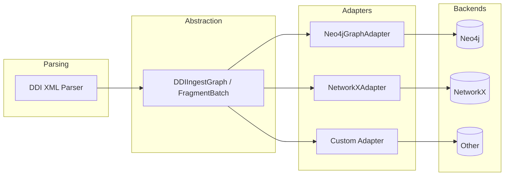

# Adaptateurs personnalisés

!!! note "À qui s'adresse cette page ?"
    Cette page est destinée aux développeurs qui veulent envoyer les données de ddigraph vers
    une base de données ou un outil qui n'est pas intégré par défaut. **Si vous utilisez Neo4j,
    RDF/SPARQL, Gremlin ou NetworkX, vous n'avez pas besoin de cette page** — ces adaptateurs
    existent déjà et fonctionnent sans configuration supplémentaire.

## Comment fonctionnent les adaptateurs

ddigraph sépare deux étapes : **lire** les données DDI depuis le XML, et les **écrire** dans
une base de données. Un **adaptateur** est le pont entre ces deux étapes — il prend les données
analysées et les écrit dans le stockage de votre choix.

Cela signifie que vous pouvez remplacer la partie stockage (Neo4j, NetworkX, votre propre base
de données) sans rien changer à la façon dont les données DDI sont lues. L'analyseur produit
toujours le même résultat ; l'adaptateur décide où il va.




## L'interface GraphWriteAdapter

Pour écrire un adaptateur personnalisé, votre classe doit implémenter l'interface
`GraphWriteAdapter` — un ensemble standard de deux méthodes que votre classe doit avoir.

En Python, une **interface** (appelée `Protocol`) est comme une fiche de poste :
« Pour être un adaptateur graphe, votre classe doit avoir les méthodes `write_batch()`
et `purge_dataset()`. » Votre classe n'a pas besoin d'hériter de quoi que ce soit — elle
a juste besoin d'avoir ces méthodes avec les bonnes signatures.

```python
from ddigraph.schema.adapter import GraphWriteAdapter


class GraphWriteAdapter(Protocol):
    def write_batch(
        self,
        graph: DDIIngestGraph,
        *,
        session_config: dict[str, object] | None = None,
        transaction_config: dict[str, object] | None = None,
    ) -> None | Awaitable[None]:
        """Écrit un lot de données DDI dans le graphe."""
        ...

    def purge_dataset(
        self,
        dataset_id: str,
        *,
        session_config: dict[str, object] | None = None,
        transaction_config: dict[str, object] | None = None,
    ) -> None | Awaitable[None]:
        """Supprime tous les nœuds et relations d'un jeu de données."""
        ...
```

## Par défaut : l'adaptateur Neo4j

Le `Neo4jGraphAdapter` intégré est utilisé automatiquement quand vous créez un `DDILoader`
sans spécifier d'adaptateur. Vous n'avez jamais besoin de le configurer manuellement :

```python
from ddigraph.ingest.loader import DDILoader
from ddigraph.config import Settings

# L'adaptateur Neo4j est créé automatiquement
loader = DDILoader(driver, settings=Settings())
await loader.load("ddi.xml", dataset_id="ds123")
```

## Écrire votre propre adaptateur

Pour utiliser une base de données qui n'est pas intégrée, écrivez une classe avec les méthodes
`write_batch()` et `purge_dataset()`, puis transmettez-la au chargeur :

```python
from ddigraph.ingest.loader import DDILoader
from ddigraph.schema.adapter import GraphWriteAdapter


class MyGraphAdapter(GraphWriteAdapter):
    async def write_batch(self, graph, **kwargs):
        # Convertir graph.nodes() / graph.relationships()
        # en opérations d'écriture spécifiques au backend
        for node in graph.nodes():
            self.backend.create_node(node["label"], node["properties"])
        for rel in graph.relationships():
            self.backend.create_relationship(
                rel["start"], rel["end"], rel["type"], rel["properties"]
            )

    async def purge_dataset(self, dataset_id, **kwargs):
        self.backend.delete_by_dataset(dataset_id)


adapter = MyGraphAdapter()
loader = DDILoader(driver, adapter=adapter)
```

Votre adaptateur reçoit un objet `DDIIngestGraph`. Appelez `graph.nodes()` pour obtenir une
liste de nœuds et `graph.relationships()` pour une liste de relations — chacun sous forme de
dictionnaire simple avec les clés `label`, `id` et `properties`.

## Exemple : adaptateur NetworkX

Le contrat d'adaptateur s'intègre aux bibliothèques de graphes populaires. Cet exemple envoie
les enregistrements ingérés dans un `MultiDiGraph` NetworkX pour une analyse locale sans base de
données :

```python
import networkx as nx

from ddigraph.ingest.loader import DDILoader
from ddigraph.schema.adapter import GraphWriteAdapter


class NetworkXAdapter(GraphWriteAdapter):
    def __init__(self):
        self.graph = nx.MultiDiGraph()

    async def write_batch(self, graph, **kwargs):
        # Ajouter les nœuds avec labels et propriétés
        for node in graph.nodes():
            label = node["label"]
            props = node["properties"]
            self.graph.add_node(node["id"], label=label, **props)
        # Ajouter les relations avec type et propriétés
        for rel in graph.relationships():
            self.graph.add_edge(
                rel["start"],
                rel["end"],
                key=rel["type"],
                **rel["properties"],
            )

    async def purge_dataset(self, dataset_id, **kwargs):
        # Supprimer les nœuds correspondant au jeu de données
        nodes_to_remove = [
            n for n, d in self.graph.nodes(data=True) if d.get("dataset_id") == dataset_id
        ]
        self.graph.remove_nodes_from(nodes_to_remove)


# Utilisation
adapter = NetworkXAdapter()
loader = DDILoader(driver=None, adapter=adapter)
await loader.load("ddi.xml", dataset_id="ds123")

# Analyser avec NetworkX
print(f"Nœuds : {adapter.graph.number_of_nodes()}")
print(f"Arêtes : {adapter.graph.number_of_edges()}")

# Trouver des chemins entre entités
paths = nx.all_simple_paths(adapter.graph, source="var1", target="concept1", cutoff=3)
```

## Chargeur FragmentInstance

Le chargeur DDI-L FragmentInstance (`DDIFragmentLoader`) utilise un patron similaire avec
`AsyncFragmentGraphWriter`, qui regroupe les fragments par type pour des requêtes UNWIND
efficaces :

```python
from ddigraph.ingest.fragment_loader import DDIFragmentLoader

loader = DDIFragmentLoader(driver, settings=settings)
result = await loader.load("questionnaire.xml")
```

L'écrivain FragmentInstance gère :

- La création de nœuds par lots selon le type d'élément
- La création de relations regroupées par type de relation
- La logique de réessai avec backoff exponentiel
- Le marquage du point d'entrée

### Extension de l'écriture FragmentInstance

Pour personnaliser la persistance des FragmentInstance, héritez de `AsyncFragmentGraphWriter` :

```python
from ddigraph.ingest.fragment_loader import AsyncFragmentGraphWriter, FragmentBatch


class CustomFragmentWriter(AsyncFragmentGraphWriter):
    async def write_batch(self, batch: FragmentBatch) -> dict[str, int]:
        # Traitement personnalisé des lots
        for element_type, fragments in batch.fragments_by_type.items():
            for fragment in fragments:
                self.custom_backend.store(fragment.to_dict())
        for from_id, rel_type, to_id in batch.relationships:
            self.custom_backend.link(from_id, rel_type, to_id)
        return {"processed": batch.total_fragments()}
```

## Autres cibles d'adaptateurs

Le patron adaptateur prend en charge divers backends :

| Cible | Cas d'utilisation |
| ------- | ------------------- |
| **Gremlin** | JanusGraph, Amazon Neptune, Azure Cosmos DB |
| **RDF/SPARQL** | Triplestores du web sémantique |
| **Pandas** | Analyse basée sur les DataFrames |
| **JSON/CSV** | Export sous forme de fichiers |
| **GraphQL** | Services de graphe basés sur une API |

### Esquisse d'un adaptateur Gremlin

```python
from gremlin_python.process.traversal import T


class GremlinAdapter(GraphWriteAdapter):
    def __init__(self, g):
        self.g = g  # GraphTraversalSource

    async def write_batch(self, graph, **kwargs):
        for node in graph.nodes():
            self.g.addV(node["label"]).property(T.id, node["id"])
            for key, value in node["properties"].items():
                self.g.property(key, value)
        for rel in graph.relationships():
            self.g.V(rel["start"]).addE(rel["type"]).to(__.V(rel["end"]))
```

## Bonnes pratiques

1. **Opérations par lots** : accumulez les écritures et videz-les par lots pour de meilleures performances
2. **Écritures idempotentes** : utilisez une sémantique MERGE/upsert pour gérer les réessais en toute sécurité
3. **Gestion des erreurs** : implémentez une logique de réessai pour les défaillances transitoires
4. **Support asynchrone** : retournez un `Awaitable` pour les backends asynchrones
5. **Métriques** : émettez des métriques de temps et de comptage pour l'observabilité

## Intégration du schéma

Les adaptateurs peuvent utiliser `DDISchema` pour obtenir des informations de schéma cohérentes :

```python
from ddigraph.schema import DDISchema

# Obtenir les définitions de nœuds
for node in DDISchema.get_all_nodes(include_fragments=True):
    print(f"{node.label}: id_field={node.id_field}, indexes={node.indexes}")

# Générer les requêtes de contraintes pour votre backend
queries = DDISchema.generate_constraint_queries(include_fragments=True)
```

## Exemples fonctionnels

Le répertoire `demo/` contient des implémentations complètes d'adaptateurs que vous pouvez
exécuter et modifier :

- **`load_rdf.py`** - Adaptateur RDF/SPARQL utilisant rdflib
  - Convertit les fragments DDI en triplets RDF
  - Exporte en Turtle, N-Triples, RDF/XML, JSON-LD
  - Illustre les requêtes SPARQL
  - Compatible avec les triplestores Virtuoso, GraphDB, Stardog

- **`load_gremlin.py`** - Adaptateur Gremlin utilisant TinkerGraph
  - Requêtes de graphe basées sur les traversées
  - Recherche de motifs et analyse de chemins
  - Compatible avec JanusGraph, Amazon Neptune, Azure Cosmos DB

- **`load_networkx.py`** - Adaptateur NetworkX pour l'analyse locale
  - Analyse de graphe en mémoire
  - Requêtes de chemins et analyse de connectivité
  - Export GraphML

- **`load_pandas.py`** - Adaptateur pandas pour l'analyse tabulaire
  - DataFrames par type de nœud
  - Analyse des relations
  - Export Excel

Chaque démonstration présente le patron complet d'implémentation d'un adaptateur avec l'analyse
syntaxique, le chargement, l'analyse et l'export. Consultez le [répertoire demo sur GitHub](https://github.com/pbisson44/ddigraph/tree/main/demo)
pour les instructions d'utilisation.

Consultez [Architecture](architecture.md) pour la conception de bout en bout et
[DDI-L FragmentInstance](fragments.md) pour les détails spécifiques aux fragments.
