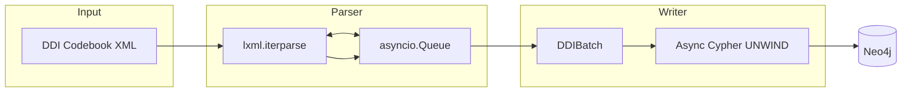
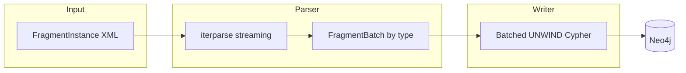
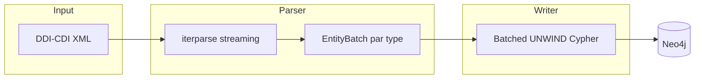

# Comment ddigraph charge vos données

!!! note "Lecture approfondie optionnelle"
    Vous n'avez pas besoin de lire cette page pour utiliser ddigraph. Elle explique la
    conception interne — utile quand vous voulez optimiser les performances ou comprendre
    pourquoi quelque chose se comporte d'une certaine façon. Si vous débutez, allez à
    [Vos premières requêtes](../getting-started/first-queries.md).

---

ddigraph convertit des fichiers DDI XML en base de données graphe. Il repose sur trois objectifs :

- **Scalabilité** — fonctionne sur des fichiers de toute taille sans manquer de mémoire
- **Observabilité** — vous pouvez voir ce qui se passe pendant un chargement
- **Isolation des pannes** — si un enregistrement échoue, les autres réussissent quand même

---

## Formats DDI pris en charge

ddigraph prend en charge trois familles de formats DDI, chacune avec son propre chargeur :

### DDI Codebook (`DDILoader`)

Le format plus ancien et plus simple. Toutes les métadonnées se connectent à un nœud central
`Dataset`.



*Le fichier est lu morceau par morceau (Parser), mis en tampon dans une file d'attente, puis
écrit dans Neo4j par lots (Writer).*

### DDI-L FragmentInstance (`DDIFragmentLoader`)

Le format DDI Lifecycle 3.x plus récent. Chaque `<Fragment>` est une pièce réutilisable de
métadonnées qui peut référencer d'autres fragments, formant naturellement une structure de graphe.



### DDI-CDI 1.0 (`parse_cdi_batches`)

DDI Cross-Domain Integration — le standard DDI le plus récent. Il décrit une plus grande
variété de types de données : concepts, variables, classifications, structures de données
et processus.



### Détection automatique du format

ddigraph peut détecter automatiquement le format de votre fichier. Il lit l'élément XML racine :

- `FragmentInstance` → utilise le chargeur lifecycle
- `codeBook`, `codebook`, `DDIInstance` → utilise le chargeur codebook
- Espace de noms DDI-CDI ou éléments racines CDI → utilise le chargeur CDI

Vous pouvez aussi appeler `detect_ddi_format("votre_fichier.xml")` en Python, ou laisser la
CLI choisir automatiquement avec `ddigraph load`.

---

## Ce qui est chargé

### DDI Codebook

Le chargeur Codebook extrait ces catégories de métadonnées en nœuds du graphe :

- **Jeux de données et études** — l'étude globale et ses événements de collecte de données
- **Fichiers et structures** — fichiers de données, enregistrements logiques et structures physiques
- **Variables et questions** — questions, grilles de questions, flux de questions et variables
  (incluant les liens vers les univers, catégories et questions sources)
- **Codes et concepts** — listes de codes, catégories, concepts, univers et représentations
- **Groupes et organisations** — organisations, séries, groupes et groupes de catégories
- **Méthodologie et traitement** — procédures d'échantillonnage, pondérations, notes
  méthodologiques et événements de traitement
- **Couverture étendue** — citations, couverture géographique/temporelle, financement,
  instruments de collecte et politiques d'accès

### DDI-L FragmentInstance

Le chargeur FragmentInstance préserve la structure de graphe des fichiers DDI-L 3.x :

| Type de nœud | Ce qu'il représente |
| --------------- | ------------------- |
| `Instrument` | L'instrument d'enquête (point d'entrée) |
| `Sequence` | Une liste ordonnée de questions |
| `IfThenElse` | Une branche conditionnelle (montrer la question seulement si...) |
| `Loop` | Une section répétée |
| `QuestionConstruct` | Une référence de question dans le flux |
| `QuestionItem` | Une seule question |
| `QuestionGrid` | Une grille/matrice de questions |
| `CodeList` | Une liste de choix de réponses |
| `Category` | Un seul choix de réponse |
| `StatementItem` | Texte d'affichage (pas une question) |
| `ComputationItem` | Une variable dérivée ou calculée |
| `Universe` | La population à laquelle cette question s'applique |
| `Concept` | Une définition conceptuelle |
| `Variable` | Une variable de données |
| `StudyUnit` | Métadonnées globales de l'étude |
| `DataCollection` | Métadonnées de collecte de données |

Consultez [DDI-L FragmentInstance](fragments.md) pour une couverture détaillée.

### DDI-CDI 1.0

Le chargeur CDI couvre l'ensemble des 210 éléments d'entité concrets de niveau supérieur déclarés
dans `ddi-cdi.xsd`. Les ~35 types les plus fréquemment référencés utilisent des classes
d'enregistrement dédiées ; les autres entités passent par `CDIGenericRecord`. Un échantillon
représentatif des types dédiés par domaine :

| Types de nœuds | Domaine |
| --------------- | ------- |
| `Concept`, `ConceptualDomain`, `ConceptSystem`, `UnitType`, `Universe`, `Population` | Concepts |
| `InstanceVariable`, `RepresentedVariable`, `ConceptualVariable` | Variables |
| `Category`, `Code`, `ClassificationIndex`, `ClassificationItem`, `CodeList`, `StatisticalClassification` | Classifications |
| `WideDataSet`, `WideDataStructure`, `DataStore`, `LogicalRecord` | Structures de données |
| `Agent`, `Activity`, `CorrespondenceTable` | Agents et processus |

---

## Configuration

ddigraph lit ses paramètres depuis les variables d'environnement (ou un fichier `.env`).
Les principaux paramètres sont :

- **Connexion Neo4j** — URI, nom d'utilisateur, mot de passe, nom de la base de données
- **Traitement par lots** — `chunk_size` (enregistrements par lot), `queue_maxsize`, `writer_concurrency`
- **Réessais** — `write_retry_attempts`, `write_retry_base_delay`, `write_retry_jitter`
- **Analyse** — `strict_parsing` (échouer sur XML invalide), `dry_run`, `replace`

Consultez [Configuration](../reference/configuration.md) pour tous les paramètres disponibles.

---

## Comment fonctionne le schéma

Tous les types de nœuds, relations et contraintes de base de données sont définis en un seul
endroit : `ddigraph.schema.definitions`. Cette source unique de vérité est utilisée par les
chargeurs, l'initialisation du schéma et les adaptateurs.

```python
from ddigraph.schema import DDISchema

# Générer toutes les requêtes d'index/contraintes
queries = DDISchema.generate_all_schema_queries(include_fragments=True, include_cdi=True)

# Obtenir le type de relation pour un champ de référence DDI-L
rel_type = DDISchema.get_fragment_relationship_type("ControlConstructReference")
# Retourne : "HAS_CONSTRUCT"
```

### Initialisation du schéma

Exécutez `ddigraph bootstrap` une fois avant votre premier chargement. Cela crée :

- **Contraintes d'unicité** sur les champs d'identité (`id` pour les nœuds Codebook,
  `fragment_id` pour les nœuds FragmentInstance) — évite les nœuds en double
- **Index secondaires** sur `name`, `label` et `description` — rend les recherches rapides

C'est sûr de l'exécuter plusieurs fois. Si l'index ou la contrainte existe déjà, rien ne change.

```bash
ddigraph bootstrap                          # Codebook + DDI-L (par défaut)
ddigraph bootstrap --no-include-fragments   # Codebook uniquement
```

---

## Comment les grands fichiers restent rapides

### Analyse en flux (Streaming)

ddigraph utilise `iterparse` — un analyseur XML en flux qui lit un élément à la fois.
Après le traitement de chaque élément, il est supprimé de la mémoire. Cela maintient
l'utilisation de la mémoire constante quelle que soit la taille du fichier.

```python
# Chaque élément est traité puis immédiatement supprimé de la mémoire
for _, elem in etree.iterparse(xml_file, events=("end",)):
    process(elem)
    elem.clear()
    while elem.getprevious() is not None:
        del elem.getparent()[0]
```

Sans streaming, un fichier de 5 Go nécessiterait 5 Go de RAM. Avec le streaming, le même
fichier n'utilise qu'une petite quantité fixe de mémoire.

### Contre-pression (chargeur Codebook)

Une file d'attente se trouve entre l'analyseur et l'écrivain de base de données. Si la base
de données écrit lentement, la file d'attente se remplit. Une fois pleine, elle met l'analyseur
en pause jusqu'à ce que l'écrivain rattrape son retard. Cela empêche la mémoire de croître sans
limite quand l'écriture est plus lente que la lecture.

Pensez-y comme un tampon à un car-wash : si la baie de lavage est pleine, aucune autre voiture
n'est admise jusqu'à ce qu'une sorte.

### Écritures par lots

Au lieu d'écrire un enregistrement à la fois dans Neo4j, ddigraph regroupe les enregistrements
en lots et les envoie tous en une seule requête avec la clause Cypher `UNWIND` :

```cypher
UNWIND $batch AS props
MERGE (n:Sequence {fragment_id: props.fragment_id})
SET n += props
```

Cela réduit les allers-retours vers la base de données de 10 à 100 fois. Au lieu de 1 000
requêtes (une par enregistrement), il peut n'y en avoir que 10 (100 enregistrements chacune).

### E/S asynchrones

- **Chargeur Codebook** — lit et écrit en même temps avec plusieurs tâches d'écriture concurrentes
- **Chargeur FragmentInstance** — écrit de façon asynchrone pendant que l'analyse se poursuit par lots

---

## Tolérance aux pannes

| Fonctionnalité | Ce que ça signifie |
|---|---|
| Initialisation du schéma répétable | Utilise `IF NOT EXISTS` — l'exécuter deux fois ne casse rien |
| Isolation au niveau du lot | Chaque lot est sa propre transaction — un échec n'affecte pas les autres |
| Sémantique `MERGE` | Réessayer un lot échoué ne créera pas de nœuds en double |
| Réessai avec délai progressif | Les erreurs temporaires de Neo4j sont réessayées automatiquement |
| Validation des entrées | Les mauvaises valeurs de configuration sont détectées au démarrage |

---

## Ajouter un backend personnalisé

Le chargeur envoie les données via une interface `GraphWriteAdapter` (un ensemble standard
de méthodes). Vous pouvez connecter n'importe quelle base de données en écrivant une classe
qui implémente cette interface.
Consultez [Adaptateurs personnalisés](adapter.md) pour des exemples.

### Ajouter des types de nœuds personnalisés

Pour ajouter vos propres types de nœuds ou relations :

1. Étendez `DDISchema` dans `src/ddigraph/schema/definitions/`
2. Mettez à jour le chargeur approprié pour extraire les nouveaux éléments XML
3. Régénérez les requêtes d'initialisation depuis le schéma

---

## CI/CD

GitHub Actions exécute Ruff (style de code), mypy (vérification des types) et pytest (tests)
à chaque push et pull request. Cela prévient les régressions et maintient la qualité du code.
